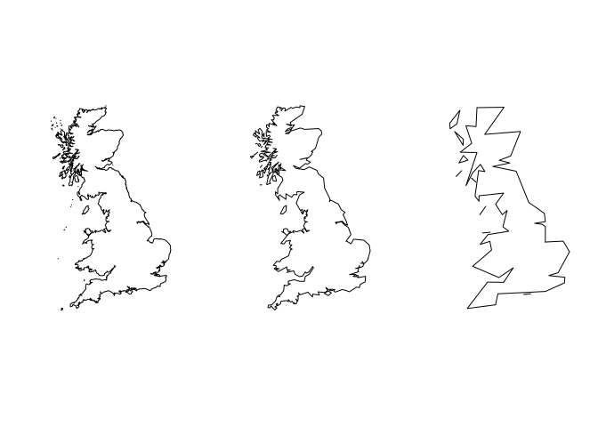

<!-- README.md is generated from README.Rmd. Please edit that file -->
gshhg
=====

[](https://www.tidyverse.org/lifecycle/#experimental)

Installation
------------

You can install gshhg from github with:

``` r
# install.packages("devtools")
devtools::install_github("jsta/gshhg")
```

Usage
-----

``` r
library(gshhg)
```

``` r
# Download raw data
gshhg_get(version = "2.3.7")
```

``` r
library(sf)
#> Linking to GEOS 3.5.1, GDAL 2.2.2, proj.4 4.9.2

dt <- st_read(
  list.files(file.path(gshhg:::cache_path(), "2.3.7", "GSHHS_shp", "i"), 
             pattern = "L1.shp", full.names = TRUE, include.dirs = TRUE))
#> Reading layer `GSHHS_i_L1' from data source `/home/jose/.local/share/gshhg/2.3.7/GSHHS_shp/i/GSHHS_i_L1.shp' using driver `ESRI Shapefile'
#> Simple feature collection with 32830 features and 6 fields
#> geometry type:  POLYGON
#> dimension:      XY
#> bbox:           xmin: -180 ymin: -68.91981 xmax: 180 ymax: 83.63339
#> epsg (SRID):    4326
#> proj4string:    +proj=longlat +datum=WGS84 +no_defs

bb <- st_sfc(st_polygon(list(rbind(c(-6.46, 49.696), 
                             c(-7.2, 58.768), 
                             c(1.9336, 58.7909), 
                             c(2.417, 50.18), 
                             c(-6.46, 49.696)))), crs = 4326)

dt_britain <- dt[sapply(st_within(dt, bb), 
                        function(x) length(x) > 0),]
#> although coordinates are longitude/latitude, st_within assumes that they are planar

plot(dt_britain$geometry)
```



References
----------

See <http://www.soest.hawaii.edu/pwessel/gshhg/>
